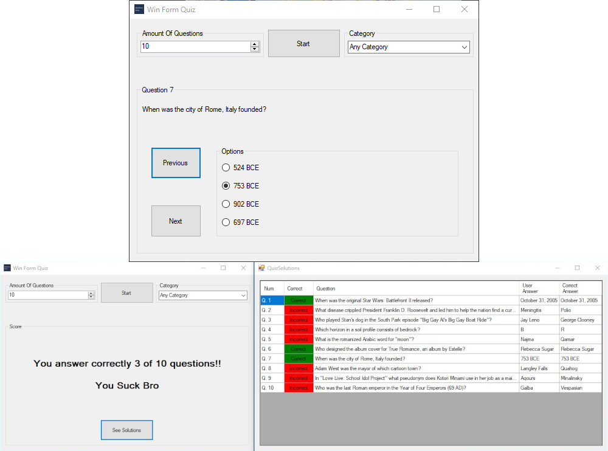

Win Form Quiz is another project created to study Windows Forms, a subject at my High School. It's a simple question game that consumes data from an API.
Download the game [here](https://github.com/Darguima/Win-Form-Quiz/releases/tag/v1.0.0).

###### Technologies used: `C#` & `Windows Forms`

